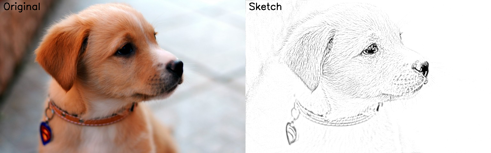

# ✏️ Image to Pencil Sketch

Transforms RGB images into pencil sketch-style drawings using image processing techniques with OpenCV.

---

## 📌 Overview

This project explores an image processing pipeline to simulate a pencil sketch effect by applying classical transformations such as:

- Grayscale conversion  
- Image inversion  
- Gaussian blur smoothing  
- Pixel-wise division (dodge blend)  
- Contrast enhancement using CLAHE  

---

## 🧠 Processing Pipeline

1. Load RGB image  
2. Convert to grayscale  
3. Invert the image  
4. Apply Gaussian blur  
5. Invert the blurred image  
6. Combine images using pixel-wise division (dodge blend)  
7. Apply adaptive contrast enhancement (CLAHE)  
8. Generate the final pencil sketch effect  

---

## 🖼️ Result



---

## ⚙️ Technologies

- Python  
- OpenCV (built on NumPy arrays)  

---

## 📁 Project Structure

```bash
image-to-pencil-sketch/
│
├── images/
│   ├── input/
│   │   └── dog.jpg
│   └── output/
│       ├── pencil_sketch.png
│       └── before_after_sketch.png
│
├── src/
│   └── sketch.py
│
├── requirements.txt
└── README.md
```
---

## 🚀 How to Run

```bash
pip install -r requirements.txt
python src/sketch.py
```
---

## 💡 Key Learnings
- Image data manipulation as numerical matrices
- Building transformation pipelines
- Parameter tuning for visual quality
- Applying adaptive contrast techniques
  
---

## 📈 Future Improvements
- Batch processing for multiple images
- Simple UI with Streamlit
- Export different sketch styles
- Integration into data pipelines

---

## 👩‍💻 Author

Thaís Fernanda Gimenes
Data Engineer | Interested in Machine Learning & AI 🚀


