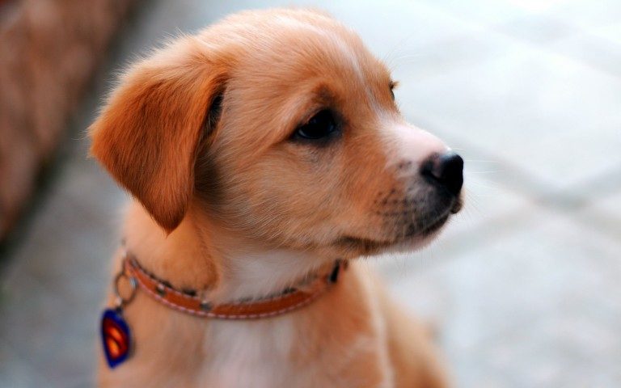
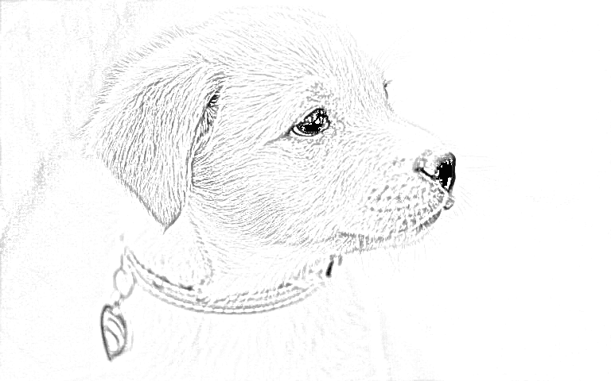

# ✏️ Image to Pencil Sketch

Projeto em Python que transforma uma imagem colorida (RGB) em um desenho estilo lápis utilizando técnicas de processamento de imagem com OpenCV.

---

## 📌 Objetivo

Explorar transformações em imagens para simular o efeito de sketch, aplicando:

- Conversão para escala de cinza
- Inversão de imagem
- Suavização com Gaussian Blur
- Combinação de imagens via divisão de pixels

---

## 🧠 Pipeline do Projeto

1. Leitura da imagem RGB  
2. Conversão para grayscale  
3. Inversão da imagem  
4. Aplicação de blur (Gaussian Blur)  
5. Inversão da imagem borrada  
6. Combinação com a imagem original usando divisão  
7. Geração do efeito de desenho a lápis  

---

## 🖼️ Exemplo de Resultado

| Original | Sketch |
|----------|--------|
|  |  |

---

## ⚙️ Tecnologias Utilizadas

- Python
- OpenCV
- NumPy

---

## 📁 Estrutura do Projeto
image-to-pencil-sketch/
│
├── images/
│ ├── input/
│ │ └── dog.jpg
│ └── output/
│ └── pencil_sketch.png
│
├── src/
│ └── sketch.py
│
├── requirements.txt
└── README.md

